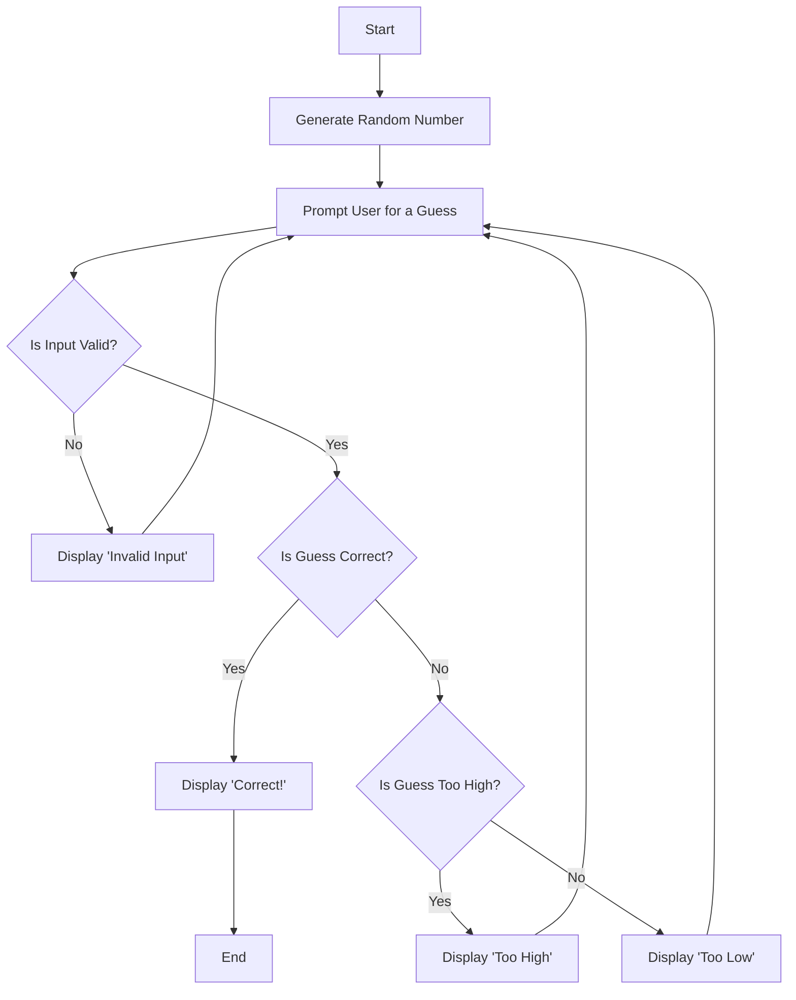

```mermaid
flowchart TD
    A[Start] --> B[Generate Random Number]
    B --> C[Prompt User for a Guess]
    C --> D{Is Input Valid?}
    D -- No --> E[Display 'Invalid Input'] --> C
    D -- Yes --> F{Is Guess Correct?}
    F -- Yes --> G[Display 'Correct!'] --> H[End]
    F -- No --> I{Is Guess Too High?}
    I -- Yes --> J[Display 'Too High'] --> C
    I -- No --> K[Display 'Too Low'] --> C
```
