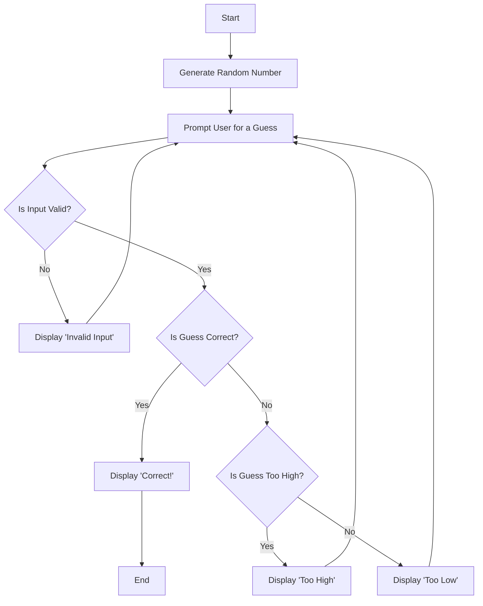

# Random Number Guessing Game Flowchart

**This flowchart models a number guessing game. The computer selects a random number and the user keeps guessing numbers until they find the correct one.** 

If they do not enter a valid input, it will prompt the user for another guess. If the guess is incorrect, the computer will notify and help the user by telling them if their guess was too high or too low. It will them reprompt the user to try again until the user finally guesses correctly. The gaame ends when this happens and it will notify the user that they were correct.

